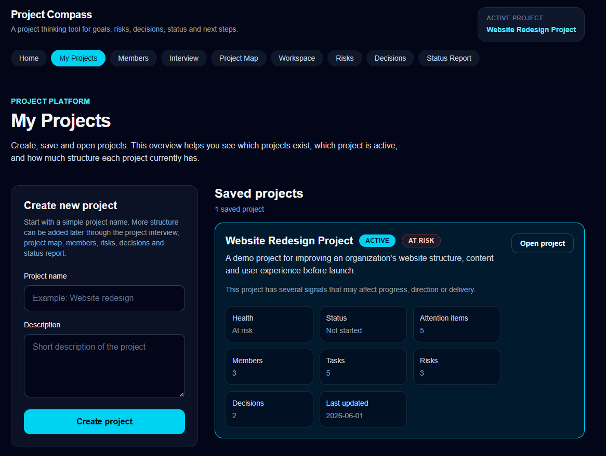
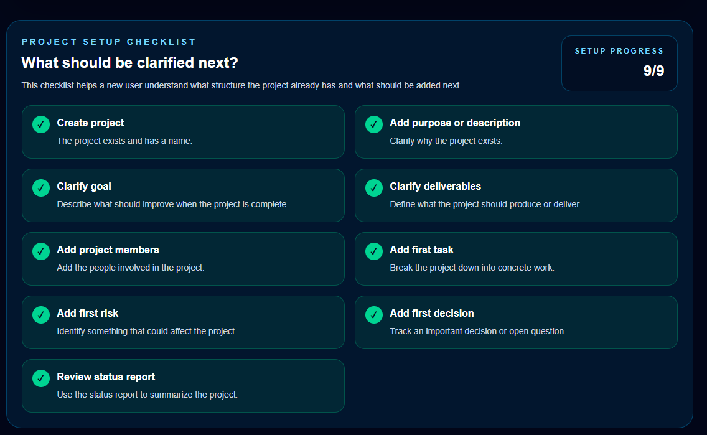
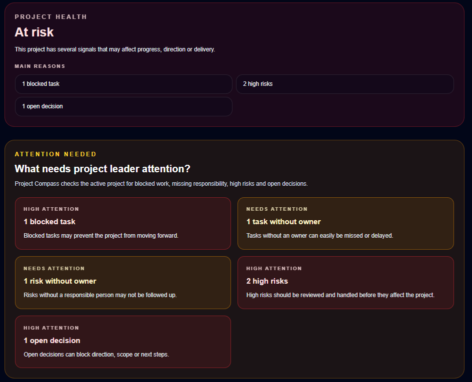
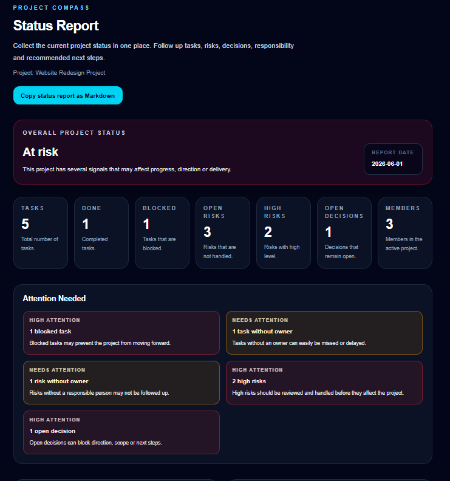

# Project Compass

Project Compass is a project clarity and project management MVP built with Next.js, TypeScript, Tailwind CSS, Playwright, GitHub Actions and Vercel.

The goal of the project is to explore how a project tool can help users understand, structure and lead a project before the work becomes only a list of tasks.

Many project tools start with boards, cards and task tracking. Project Compass starts one step earlier:

* Why are we doing this project?
* What should become better?
* What should be delivered?
* Who is involved?
* Who is responsible for what?
* What is blocked?
* Which risks need attention?
* Which decisions are still open?
* Which tasks are affected by risks or decisions?
* How healthy is the project right now?
* Why does the project have that health status?
* What should happen next?

Project Compass helps teams turn unclear work into a manageable project.

---

## Live demo

Project Compass is deployed on Vercel:

https://project-compass-seven.vercel.app/

The app currently uses `localStorage`, which means saved projects are stored locally in the browser used for testing.

---

## Screenshots

### My Projects overview

The My Projects overview shows saved projects, active project status, Project Health, Attention Needed and key project metrics.



### Project setup checklist

The Project setup checklist helps a new user understand what project structure already exists and what should be clarified next.



### Project Health and Attention Needed

Project Compass interprets project signals and highlights blocked work, missing ownership, high risks and open decisions.



### Status Report

The Status Report summarizes project status, tasks, risks, decisions, members, Attention Needed, Project Health, Project Health Score, main health reasons, traceability and a recommended next step.



---

## Product idea

Project Compass is not intended to be a copy of Trello, Jira, Taiga, Asana, ClickUp or Reqtest.

Its strength is project clarity.

The app is designed for smaller projects where direction, responsibility, risks, decisions, traceability and status matter more than advanced enterprise workflow features.

Examples of suitable use cases:

* Student projects
* Smaller project groups
* Associations
* Municipal working groups
* Education projects
* Early product ideas
* QA and testing projects
* Project leaders who need structure before the work becomes too large

The core product question is:

```text
Does this help the user understand, steer or improve the project?
```

If the answer is yes, the feature fits Project Compass.

---

## Purpose

The purpose of Project Compass is to help users think clearly about a project before and during execution.

The app focuses on:

* Purpose
* Goals
* Deliverables
* Members
* Responsibility
* Tasks
* Risks
* Decisions
* Attention Needed
* Project Health
* Project Health Score
* Health reasons
* Traceability
* Status
* Recommended next step
* Shareable reporting

The product should help the user move from unclear work to a structured, responsible and manageable project.

---

## Current status

Project Compass has grown from a single-project MVP into a small project platform.

The current version includes:

* Landing page
* Project interview
* My Projects overview
* Example project/demo data
* Multiple saved projects in `localStorage`
* Active project handling
* Active project shown in the app header
* Project members
* Project board / Kanban-style task board
* Risk register
* Decision log
* Project setup checklist
* Project Map
* Project Health
* Project Health Score
* Project Health reasons
* Improved Project Health summary text
* Attention Needed
* Recommended Next Step
* Status Report
* Markdown export
* Responsibility model for tasks, risks and decisions
* Missing ownership indicators
* Risk-to-task traceability
* Decision-to-task traceability
* Traceability overview in Project Map
* Traceability in Status Report
* Traceability in Markdown export
* Recommended Next Step in Status Report
* Recommended Next Step in Markdown export
* Project Health Score in Status Report and Markdown export
* Playwright coverage for Recommended Next Step in Markdown export
* Playwright coverage for Project Health Score in Markdown export
* Playwright scenario coverage for Stable, Needs attention and At risk
* Form validation for project name, task title, risk title and decision title
* Improved form accessibility
* Improved empty states
* Improved no active project handling
* Shared project insight logic
* Manual regression test documentation
* Automated end-to-end tests with Playwright
* GitHub Actions CI
* Live deployment on Vercel

### Version 1.1 – Stabilization and clarity

Version 1.1 focused on making the app easier to understand, safer to use and easier to demonstrate.

Completed improvements include:

* Better empty states
* Clearer no active project handling
* Project setup checklist
* Improved Project Map
* Clearer active project overview
* Basic form validation
* Better error messages
* Improved navigation
* Example project/demo data
* README improvements
* Playwright coverage for important flows

### Version 1.2 – Responsibility and Attention Needed

Version 1.2 focused on making the app more useful for project leadership.

Completed improvements include:

* Tasks can have a responsible member
* Risks can have a responsible member
* Decisions can have a responsible member
* Tasks without owner are highlighted
* Risks without owner are highlighted
* Decisions without owner are highlighted
* Blocked tasks are detected
* High risks are detected
* Open decisions are detected
* Attention Needed is shown in My Projects, Project Map, Status Report and Markdown export
* Attention items have High or Medium severity
* Project Health is shown in My Projects, Project Map and Status Report
* Shared project insight logic was extracted to reduce duplication

### Version 1.3 – Traceability MVP

Version 1.3 focused on showing how project objects are connected.

Completed traceability improvements include:

* Risks can be linked to related tasks
* Decisions can be linked to related tasks
* Risk View shows related task
* Decision View shows related task
* Project Map shows risk-to-task links
* Project Map shows decision-to-task links
* Project Map distinguishes linked and unlinked items
* Status Report shows which task a risk affects
* Status Report shows which task a decision affects
* Markdown export includes risk-to-task links
* Markdown export includes decision-to-task links

This means Project Compass now shows not only that a risk or decision exists, but also which concrete work it affects.

### Version 1.4 – Status Report and Project Health

Version 1.4 focuses on making the Status Report more useful as a project communication artifact.

Completed improvements so far include:

* Project Health shown in Status Report
* Main Project Health reasons shown in Status Report
* Main Project Health reasons included in Markdown export
* Rule-based Project Health Score calculated from attention signals
* Project Health Score shown in Status Report
* Project Health Score included in Markdown export
* Improved Project Health summary text based on project signals
* Recommended Next Step calculated from project signals
* Recommended Next Step shown in Status Report
* Recommended Next Step included in Markdown export
* Playwright test coverage for Recommended Next Step in Markdown export
* Playwright test coverage for Project Health Score in Markdown export
* Playwright scenario coverage for Stable, Needs attention and At risk

This means the Status Report no longer only lists project information. It now helps explain the project situation, shows a simple project health signal and suggests what the project leader should do next.

---

## QA highlights

This project is built as both a product MVP and a software testing portfolio case.

It demonstrates:

* Product thinking before implementation
* Manual regression testing of the full MVP flow
* Exploratory testing with documented bug findings
* Bug fixing and regression verification
* Playwright end-to-end testing
* Cross-browser landing page testing
* Chromium-based focused product testing
* Form validation testing
* Negative input testing
* Accessibility-focused form improvements
* Empty state testing
* No active project state testing
* Responsibility testing for tasks, risks and decisions
* Attention Needed testing
* Project Health testing
* Project Health reasons tested through Markdown export coverage
* Project Health Score tested through Markdown export coverage
* Project Health scenario tests for Stable, Needs attention and At risk
* Recommended Next Step behavior tested with Playwright
* Markdown export testing
* Markdown export verification of project interpretation, health reasons, health score and recommended next step
* Traceability regression through existing risk, decision, Project Map and Status Report tests
* Rule-based project insight testing through shared helper logic
* GitHub Actions CI pipeline
* Playwright report artifact upload
* Written test strategy and manual test documentation
* Incremental feature development with clear commits
* Deployment to Vercel as a live portfolio demo

The goal is not only to build a working application, but to show how a tester can think about product quality, user flows, risk, regression, automation and maintainability.

---

## Portfolio value

This repository is intended to show practical QA and test automation skills in a realistic product context.

The example project helps teachers, recruiters and LIA contacts understand the product idea, project flow and QA value within a few minutes.

It demonstrates that I can:

* Understand and structure a product idea
* Identify important user flows
* Document scope, roadmap and test strategy
* Think through product changes before coding
* Work in small, testable and committable steps
* Perform manual regression testing
* Find and document usability issues
* Verify bug fixes through regression testing
* Write Playwright end-to-end tests
* Make tests more precise when UI changes create ambiguity
* Mock browser APIs when needed for reliable E2E testing
* Connect automated tests to GitHub Actions
* Deploy a Next.js app to Vercel
* Use Git commits to document progress and technical decisions
* Refactor duplicated logic into shared helpers
* Build a product while continuously evaluating quality and risk
* Turn project data into actionable project leadership signals
* Explain Project Health with clear health reasons
* Show a simple Project Health Score without pretending it is an exact performance metric
* Test Project Health through multiple scenarios
* Recommend a next project leadership action based on project data
* Make missing responsibility visible directly in the user interface
* Connect risks to concrete project work
* Connect decisions to concrete project work
* Add traceability between project objects in small, safe iterations
* Extend an existing traceability model without rebuilding the whole data structure
* Improve status reporting so risks, decisions, blocked work and missing ownership become visible
* Improve Markdown export so project interpretation can be shared outside the app
* Improve form validation and error handling from a user perspective
* Improve accessibility for important forms and error messages
* Improve empty states so new users understand what to do next
* Improve recovery paths when the user has no active project selected

The project shows both a builder mindset and a tester mindset: creating a working MVP while continuously asking what could break, what should be verified and how quality can be made visible.

---

## Main features

### My Projects overview

The My Projects page allows the user to:

* Create a new project
* Create an example project with demo data
* Save multiple projects
* View saved projects
* Open a selected project
* See which project is active
* See project status
* See calculated Project Health
* See Attention Needed preview
* See whether attention items are High or Medium priority
* See project member count
* See task count
* See risk count
* See decision count
* See when the project was last updated

This makes the overview more useful as a project leadership view, not only a list of saved projects.

### Example project

The example project allows visitors to explore Project Compass without creating all content manually.

It includes example:

* Members
* Tasks
* Risks
* Decisions
* Responsibility
* Attention Needed
* Project Health
* Traceability

This makes the app easier to demonstrate to teachers, recruiters and LIA contacts.

### Active project model

The application stores an active project ID.

The active project owns:

* Members
* Tasks
* Risks
* Decisions

This means that the main project data belongs to the selected project instead of being stored as separate global lists.

### Project setup checklist

Project Map includes a Project setup checklist.

The checklist helps a new user understand what structure the project already has and what should be added next.

The checklist checks whether the project has:

* Project name
* Purpose or description
* Goal
* Deliverables
* Project members
* Tasks
* Risks
* Decisions
* Status report ready to review

The checklist is intentionally simple. It does not store separate checkbox state. Instead, it calculates progress from existing project data.

### Project Map

The Project Map summarizes the active project and gives the user an overview before moving into detailed work.

It includes:

* Project name
* Project description or purpose
* Project setup checklist
* Active project summary
* Project Health
* Attention Needed with High and Medium severity
* Traceability overview for risk-to-task links
* Traceability overview for decision-to-task links
* Linked and unlinked risk indicators
* Linked and unlinked decision indicators
* Project direction cards
* Recommended next step

The Project Map is one of the key product views because it helps the user understand the project before managing individual tasks.

### Project members

Each project can have members with:

* Name
* Role
* Responsibility
* Comment

Members are saved per project and persist after page reload.

### Task responsibility

Tasks in the workspace can have a responsible member.

The user can:

* Create a task
* Assign the task to a project member
* See the responsible member on the task card
* Reload the page and keep the responsibility assignment

If a task has no responsible member, Workspace shows:

```text
Responsible: Unassigned
Needs owner
```

Tasks are stored in the active project data model.

### Risk responsibility and traceability

Risks in the risk register can have a responsible member.

The user can:

* Create a risk
* Assign the risk to a project member
* Link the risk to a related task
* See the responsible member on the risk card
* See which task the risk affects
* Reload the page and keep the responsibility and traceability data

If a risk has no responsible member or legacy owner note, Risk View shows:

```text
Responsible: Unassigned
Needs owner
```

Risks can also be linked to a related task. This helps the user understand which concrete work a risk may affect.

### Decision responsibility and traceability

Decisions in the decision log can have a responsible member.

The user can:

* Create a decision
* Assign the decision to a project member
* Link the decision to a related task
* See the responsible member on the decision card
* See which task the decision affects
* Reload the page and keep the responsibility and traceability data

If a decision has no responsible member or legacy owner note, Decision View shows:

```text
Responsible: Unassigned
Needs owner
```

Decisions can also be linked to a related task. This helps the user understand which concrete work a decision affects and why the decision matters.

### Attention Needed

Project Compass can highlight project items that need project leader attention.

The current version of Attention Needed checks the active project for:

* Blocked tasks
* Tasks without owner
* Risks without owner
* High risks
* Decisions without owner
* Open decisions

Attention Needed is shown in:

* My Projects overview
* Project Map
* Status Report
* Markdown export

Attention items include a severity level:

* High
* Medium

High severity is used for signals such as blocked tasks, high risks and open decisions.

Medium severity is used for missing ownership, such as tasks, risks or decisions without a responsible person.

### Project Health

Project Compass includes a first Project Health MVP.

The app can show one of three health levels:

* Stable
* Needs attention
* At risk

The health level is based on simple project signals such as:

* Blocked tasks
* High risks
* Open decisions
* Attention items
* Missing ownership

Project Health is currently shown in:

* My Projects overview
* Project Map
* Status Report

In the Status Report, Project Health also includes main reasons. These reasons explain why the project is currently considered stable, in need of attention or at risk.

Project Compass also includes a simple rule-based Project Health Score.

The score starts at 100 and is reduced when the active project contains attention signals such as blocked tasks, high risks, open decisions or missing ownership.

The score is shown in the Status Report and included in the Markdown export.

Project Health scenario tests verify that the app can show Stable, Needs attention and At risk for different project situations.

This is not intended to be an exact project performance calculation. It is an MVP indicator designed to make project signals easier to understand and discuss.

### Recommended Next Step

Project Compass can recommend a next project leadership action based on the active project data.

The current Recommended Next Step logic prioritizes:

* Blocked tasks
* High risks
* Open decisions
* Missing ownership
* Missing tasks
* Missing members
* Next checkpoint preparation when no urgent signals exist

The recommendation is shown in:

* Status Report
* Markdown export

This helps the Status Report become more than a summary. It gives the project leader a clear suggested next action.

### Shared project insight logic

Attention Needed, Project Health, Project Health Score and Recommended Next Step are calculated through shared project insight logic in:

```text
src/lib/projectInsights.ts
```

This helper currently includes:

* `getAttentionItems(project)`
* `getProjectHealth(project, attentionItems)`
* `getRecommendedNextStep(project, attentionItems)`

The purpose is to make sure that My Projects, Project Map and Status Report use the same interpretation of project data.

This reduces duplicated logic, improves maintainability and lowers the risk that different views show different project status information.

### Status report

The status report summarizes:

* Overall project status
* Project Health Score
* Main Project Health reasons
* Total tasks
* Done tasks
* Blocked tasks
* Open risks
* High risks
* Open decisions
* Number of members
* Attention Needed with High and Medium severity
* Project purpose
* Project goal
* Project members
* Task responsibility
* Risk responsibility
* Decision responsibility
* Risk-to-task links
* Decision-to-task links
* Recommended Next Step

The status report is intended to become the main communication artifact for a project.

Risk-to-task and decision-to-task links are included in both the on-screen report and the Markdown export, making the report more useful as a project communication artifact.

The Recommended Next Step helps the project leader understand what should happen next based on the current project signals.

The Project Health Score gives the user a simple numerical signal that supports the health level and main reasons without pretending to be an exact performance metric.

### Markdown report export

The status report can be copied as Markdown.

The exported report includes:

* Project name
* Date
* Overall project status
* Project Health Score
* Main Project Health reasons
* Summary metrics
* Attention Needed with High and Medium severity
* Purpose
* Goal
* Deliverables
* Project members
* Task responsibility
* Risk responsibility
* Decision responsibility
* Risk-to-task links
* Decision-to-task links
* Recommended Next Step

This makes the report usable outside the app, for example in GitHub, Teams, documentation, school assignments or project meetings.

### Form validation

Project Compass includes basic form validation for important user flows.

The app currently validates:

* Project name when creating a project
* Task title when creating a task
* Risk title when creating a risk
* Decision title when creating a decision

If a required title or name is missing, the app shows a clear validation message, for example:

```text
Project name is required.
Task title is required.
Risk title is required.
Decision title is required.
```

The relevant input is also marked with `aria-invalid="true"` while the validation error is active.

### Form accessibility

Project Compass includes accessibility improvements for the most important forms.

The current form accessibility improvements include:

* Labels connected to form fields
* Required project, task, risk and decision fields marked with `aria-required="true"`
* Validation state shown with `aria-invalid`
* Error messages connected to inputs with `aria-describedby`
* Error messages using `role="alert"` and `aria-live="polite"`
* Forms connected to headings and help text with `aria-labelledby` and `aria-describedby`

These improvements make validation errors easier to understand and support better use with assistive technologies.

### Empty states and no active project handling

Project Compass includes improved empty states for the main project work views.

The app gives extra guidance when there are no:

* Tasks in Workspace
* Risks in Risk View
* Decisions in Decision View

Project Compass also includes clearer guidance when the user opens an important project page without an active project selected.

The app currently shows a no active project state on:

* Workspace
* Risk View
* Decision View
* Project Map
* Status Report

These states explain why an active project is needed and guide the user back to My Projects.

---

## Application flow

The current main product flow is:

1. Open the landing page
2. Go to My Projects
3. Create, open or create an example project
4. Review Project Health and Attention Needed preview in My Projects
5. Open the project map
6. Review the Project setup checklist
7. Review active project summary
8. Review Attention Needed with severity
9. Review Project Health
10. Review traceability between risks, decisions and tasks
11. Add project members
12. Open the workspace
13. Create tasks
14. Assign task responsibility
15. Add risks to the risk register
16. Assign risk responsibility
17. Link risks to related tasks
18. Add decisions to the decision log
19. Assign decision responsibility
20. Link decisions to related tasks
21. Open the status report
22. Review project status, health score, health reasons, members, responsibilities, risks, decisions, attention items and traceability
23. Review the Recommended Next Step
24. Copy the status report as Markdown

The original MVP flow from project interview to project map and status report still exists, but the current product direction is the project platform flow.

---

## Tech stack

* Next.js
* React
* TypeScript
* Tailwind CSS
* Playwright
* Git / GitHub
* GitHub Actions
* Vercel
* localStorage

---

## Project structure

```text
project-compass
├── docs
│   ├── manual-test-run.md
│   ├── mvp-scope.md
│   ├── product-vision.md
│   ├── project-platform-roadmap.md
│   ├── responsibility-model-plan.md
│   ├── test-strategy.md
│   └── user-stories.md
├── public
│   └── screenshots
│       ├── my-projects-overview.png
│       ├── project-health-attention.png
│       ├── project-map-checklist.png
│       └── status-report.png
├── src
│   ├── app
│   │   ├── new-project
│   │   ├── project-board
│   │   ├── project-decisions
│   │   ├── project-map
│   │   ├── project-members
│   │   ├── project-report
│   │   ├── project-risks
│   │   └── projects
│   ├── components
│   │   └── AppHeader.tsx
│   └── lib
│       ├── exampleProject.ts
│       ├── projectInsights.ts
│       └── projectStorage.ts
├── tests
│   ├── decision-responsibility.spec.ts
│   ├── example-project.spec.ts
│   ├── landing-page.spec.ts
│   ├── main-flow.spec.ts
│   ├── project-health-scenarios.spec.ts
│   ├── project-map-attention.spec.ts
│   ├── project-members.spec.ts
│   ├── project-setup-checklist.spec.ts
│   ├── projects-overview.spec.ts
│   ├── risk-responsibility.spec.ts
│   ├── status-report-markdown.spec.ts
│   └── task-responsibility.spec.ts
├── playwright.config.ts
└── README.md
```

---

## Documentation

The repository includes product and QA documentation.

```text
docs/product-vision.md
docs/mvp-scope.md
docs/user-stories.md
docs/test-strategy.md
docs/manual-test-run.md
docs/project-platform-roadmap.md
docs/responsibility-model-plan.md
```

Important planning documents:

* `product-vision.md` describes the product idea and positioning.
* `project-platform-roadmap.md` describes the move from single-project MVP to project platform.
* `responsibility-model-plan.md` describes how ownership should work for tasks, risks and decisions.
* `test-strategy.md` describes the testing approach.
* `manual-test-run.md` documents manual regression testing.
* `mvp-scope.md` describes the original MVP and the current MVP+ scope.

---

## Testing

Project Compass includes both manual and automated testing.

### Manual testing

Manual regression testing is documented in:

```text
docs/manual-test-run.md
```

Manual testing has been used to verify:

* Main MVP flow
* Navigation
* Project creation
* Example project creation from My Projects
* Project name validation
* Task title validation
* Risk title validation
* Decision title validation
* Form accessibility
* No active project handling
* Empty states
* Project persistence
* Member creation and persistence
* Task responsibility
* Risk responsibility
* Decision responsibility
* Missing ownership indicators
* Attention Needed
* Attention Needed severity
* Project Health
* Project Health Score
* Project Health scenario behavior
* Project Health reasons
* Recommended Next Step
* Project setup checklist
* Markdown copy from Status Report
* Risk-to-task linking in Risk View
* Risk-to-task traceability in Project Map
* Risk-to-task traceability in Status Report
* Risk-to-task links in Markdown export
* Decision-to-task linking in Decision View
* Decision-to-task traceability in Project Map
* Decision-to-task traceability in Status Report
* Decision-to-task links in Markdown export
* Recommended Next Step in Markdown export
* Project Health Score in Markdown export
* Standardized English UI across the main application flow
* Vercel deployment smoke test

During manual exploratory testing, several usability, navigation and test stability issues were found and fixed, including:

* Missing navigation to the project board from the landing page
* Missing home navigation from project pages
* Missing edit interview navigation from the risk view
* Unclear project opening behavior
* Missing validation feedback when trying to create a project without a name
* Empty work views that did not clearly guide the user toward the next step
* No active project states that needed clearer recovery paths
* Tests that were too tightly coupled to old UI text
* Ambiguous Playwright locators when several elements had similar text
* Navigation timing issues in the old main flow test
* Clipboard limitations in Playwright requiring a mocked clipboard implementation
* Mixed Swedish and English UI text before the English UI refactor
* Encoding issues from earlier copied text
* Windows / OneDrive `.next` file locking during local test runs

### Automated testing

Automated end-to-end tests are written with Playwright and located in:

```text
tests/decision-responsibility.spec.ts
tests/example-project.spec.ts
tests/landing-page.spec.ts
tests/main-flow.spec.ts
tests/project-health-scenarios.spec.ts
tests/project-map-attention.spec.ts
tests/project-members.spec.ts
tests/project-setup-checklist.spec.ts
tests/projects-overview.spec.ts
tests/risk-responsibility.spec.ts
tests/status-report-markdown.spec.ts
tests/task-responsibility.spec.ts
```

Current automated test coverage includes:

* Landing page and navigation
* Main project data flow
* Projects overview
* Example project demo flow
* Project name validation
* Project members
* Task responsibility
* Task validation and accessibility
* Workspace empty state
* Workspace no active project state
* Risk responsibility
* Risk validation and accessibility
* Risk View empty state
* Risk View no active project state
* Decision responsibility
* Decision validation and accessibility
* Decision View empty state
* Decision View no active project state
* Project Map Attention Needed
* Project Map severity-aware Attention Needed
* Project setup checklist
* Project Map no active project state
* Status report Markdown copy
* Status Report severity-aware Attention Needed
* Status Report Markdown severity export
* Status Report no active project state
* Status Report Project Health reasons
* Status Report Project Health Score
* Status Report Recommended Next Step
* Project Health Score in Markdown export
* Project Health scenario coverage for Stable, Needs attention and At risk
* Recommended Next Step in Markdown export
* Traceability regression through existing risk, decision, Project Map and Status Report tests

The landing page test is verified across:

* Chromium
* Firefox
* WebKit

Focused product tests are currently run in Chromium.

---

## Current Playwright coverage

### Landing page

Verifies that:

* Landing page loads
* Main heading is visible
* Navigation links are visible
* Main action links are visible

### Main flow

Verifies that:

* Stored project data can be shown in the project map
* Stored project data can be shown in the status report
* Project map and status report read the same saved project data

### Projects overview

Verifies that:

* User can open My Projects
* User sees a validation message when project name is missing
* Project name input is marked invalid when validation fails
* Project name input is marked as required for assistive technology
* Validation message disappears when the user enters a project name
* User can create a project
* Project appears in the list
* Project becomes active
* Project persists after reload
* Active project is shown in the header
* Project overview shows project summary metrics
* Project overview shows Project Health information
* Project overview shows an Attention Needed preview
* Project overview shows stable projects with no current attention items

### Example project demo flow

Verifies that:

* User can create an example project from My Projects
* Example project appears in the saved projects list
* Example project becomes the active project
* User can open the example project in Project Map
* Project Map shows demo project data, Attention Needed and Project Health
* Status Report shows example members, tasks, risks and decisions

### Project members

Verifies that:

* User can create a project
* User can add a member to the active project
* Member persists after reload
* Project overview shows member count
* Member appears in the status report

### Task responsibility

Verifies that:

* User can create a project
* User can add a project member
* User can see a no active project state when Workspace is opened without an active project
* User can see Workspace empty state when no tasks exist
* User can create a task
* User can assign the task to a member
* Task card shows the responsible member
* Responsibility persists after reload
* User sees a validation message when task title is missing
* Task title input is marked invalid when validation fails
* Task title input is marked as required for assistive technology
* Validation message disappears when the user enters a task title
* Tasks without responsible member show Unassigned
* Tasks without responsible member show Needs owner
* Tasks with responsible member do not show Needs owner

### Risk responsibility and traceability

Verifies that:

* User can create a project
* User can add a project member
* User can see a no active project state when Risk View is opened without an active project
* User can see Risk View empty state when no risks exist
* User can create a risk
* User can assign the risk to a member
* Risk card shows the responsible member
* Responsibility persists after reload
* User sees a validation message when risk title is missing
* Risk title input is marked invalid when validation fails
* Risk title input is marked as required for assistive technology
* Validation message disappears when the user enters a risk title
* Risks without responsible member show Unassigned
* Risks without responsible member show Needs owner
* Risks with responsible member do not show Needs owner
* Risks can be linked to a related task

### Decision responsibility and traceability

Verifies that:

* User can create a project
* User can add a project member
* User can see a no active project state when Decision View is opened without an active project
* User can see Decision View empty state when no decisions exist
* User can create a decision
* User can assign the decision to a member
* Decision card shows the responsible member
* Responsibility persists after reload
* User sees a validation message when decision title is missing
* Decision title input is marked invalid when validation fails
* Decision title input is marked as required for assistive technology
* Validation message disappears when the user enters a decision title
* Decisions without responsible member show Unassigned
* Decisions without responsible member show Needs owner
* Decisions with responsible member do not show Needs owner
* Decisions can be linked to a related task

### Project Map Attention Needed and traceability

Verifies that:

* User can create a project
* User can create a blocked task without owner
* User can create a high risk without owner
* User can create an open decision without owner
* Project Map shows Attention Needed
* Attention Needed shows blocked task, missing ownership, high risk and open decision signals
* Attention Needed items show severity labels
* High and Medium severity indicators are visible
* Project Map shows risk-to-task traceability
* Project Map distinguishes linked and unlinked risks
* Project Map shows decision-to-task traceability
* Project Map distinguishes linked and unlinked decisions

### Project setup checklist

Verifies that:

* User sees a no active project state when Project Map is opened without an active project
* User can create a project
* User can open Project Map
* Project setup checklist is visible
* Checklist shows setup progress
* Checklist shows expected setup steps
* Checklist helps the user understand what should be clarified next

### Project Health scenarios

Verifies that:

* Stable projects show Stable health status
* Stable projects show Project Health Score 100 / 100
* Stable projects show no current attention signals
* Projects with missing ownership show Needs attention
* Projects with missing ownership show reduced Project Health Score
* Projects with missing ownership show a concrete health summary
* Projects with several high risks show At risk
* Projects with several high risks show reduced Project Health Score
* Project Health reasons are shown for each scenario

### Status report Markdown export

Verifies that:

* User sees a no active project state when Status Report is opened without an active project
* Status report loads with stored active project data
* Copy status report as Markdown button is visible
* User can trigger Markdown copy
* Confirmation message is shown
* Exported Markdown contains project name, members, task, risk and decision data
* Exported Markdown contains Attention Needed
* Status Report shows Attention Needed severity labels
* Exported Markdown contains Attention Needed severity
* Exported Markdown distinguishes High and Medium attention items
* Status Report shows main Project Health reasons
* Exported Markdown includes main Project Health reasons
* Status Report shows Project Health Score
* Exported Markdown includes Project Health Score
* Status Report shows a Recommended Next Step
* Exported Markdown includes Recommended Next Step
* Status Report shows which task a risk affects
* Exported Markdown includes risk-to-task links
* Status Report shows which task a decision affects
* Exported Markdown includes decision-to-task links

---

## Test commands

Run all Playwright tests:

```bash
npx playwright test
```

Run the landing page test:

```bash
npx playwright test tests/landing-page.spec.ts
```

Run the main flow test in Chromium:

```bash
npx playwright test tests/main-flow.spec.ts --project=chromium
```

Run the project overview test:

```bash
npx playwright test tests/projects-overview.spec.ts --project=chromium
```

Run the example project demo flow test:

```bash
npx playwright test tests/example-project.spec.ts --project=chromium
```

Run the project members test:

```bash
npx playwright test tests/project-members.spec.ts --project=chromium
```

Run the task responsibility test:

```bash
npx playwright test tests/task-responsibility.spec.ts --project=chromium
```

Run the risk responsibility test:

```bash
npx playwright test tests/risk-responsibility.spec.ts --project=chromium
```

Run the decision responsibility test:

```bash
npx playwright test tests/decision-responsibility.spec.ts --project=chromium
```

Run the Project Map Attention Needed test:

```bash
npx playwright test tests/project-map-attention.spec.ts --project=chromium
```

Run the Project setup checklist test:

```bash
npx playwright test tests/project-setup-checklist.spec.ts --project=chromium
```

Run the Project Health scenario tests:

```bash
npx playwright test tests/project-health-scenarios.spec.ts --project=chromium
```

Run the status report Markdown test:

```bash
npx playwright test tests/status-report-markdown.spec.ts --project=chromium
```

Run the focused regression suite:

```bash
npx playwright test tests/projects-overview.spec.ts --project=chromium
npx playwright test tests/example-project.spec.ts --project=chromium
npx playwright test tests/project-members.spec.ts --project=chromium
npx playwright test tests/task-responsibility.spec.ts --project=chromium
npx playwright test tests/risk-responsibility.spec.ts --project=chromium
npx playwright test tests/decision-responsibility.spec.ts --project=chromium
npx playwright test tests/project-map-attention.spec.ts --project=chromium
npx playwright test tests/project-setup-checklist.spec.ts --project=chromium
npx playwright test tests/project-health-scenarios.spec.ts --project=chromium
npx playwright test tests/status-report-markdown.spec.ts --project=chromium
npx playwright test tests/landing-page.spec.ts
npx playwright test tests/main-flow.spec.ts --project=chromium
```

Show the latest Playwright HTML report:

```bash
npx playwright show-report
```

---

## Run the project locally

Install dependencies:

```bash
npm install
```

Start the development server:

```bash
npm run dev
```

Open:

```text
http://localhost:3000
```

Build the project:

```bash
npm run build
```

---

## Deployment

Project Compass is deployed on Vercel:

https://project-compass-seven.vercel.app/

The project is connected to GitHub, so future pushes to the main branch can be deployed automatically by Vercel.

---

## Known limitations

The current version is an MVP/portfolio project.

Known limitations:

* Data is stored in browser `localStorage`
* There are no user accounts
* There is no backend database
* There is no real-time collaboration
* Data is not shared between devices
* There is no role-based access control
* Old legacy project interview data still exists beside the newer active project model
* Some project fields are still simpler than the long-term roadmap model
* Editing and deleting all object types is not fully implemented yet
* Filtering and sorting are not fully implemented yet
* Traceability is intentionally simple and does not yet include advanced dependency graphs
* Project Health Score is intentionally simple and rule-based rather than a validated performance metric

These limitations are intentional at this stage. The focus is on product clarity, QA value, testability and a strong portfolio case.

---

## Planned next steps

Recommended next steps:

* Continue improving Status Report as the strongest communication artifact in the app
* Continue improving Project Health logic over time
* Continue refining Project Health Score rules over time
* Continue improving recommended next step logic
* Continue improving shared project insight logic over time
* Continue improving migration and cleanup from older `localStorage` keys
* Continue improving form validation and error handling
* Continue improving empty states and onboarding support
* Continue improving accessibility
* Continue traceability by linking decisions to risks
* Continue traceability by linking tasks to goals or deliverables
* Add more focused Playwright tests per module
* Add delete and duplicate project actions
* Add edit/delete for all main objects
* Add filtering and sorting
* Consider persistent backend storage in a later version
* Add a clearer “What I learned” section
* Add a QA/test module in a later version

---

## Learning focus

This project is also part of a software testing learning journey.

It demonstrates:

* Building a small product MVP
* Thinking in user flows
* Documenting test strategy
* Writing manual regression tests
* Finding and fixing usability bugs
* Installing and using Playwright
* Writing automated end-to-end tests
* Using Git commits to document progress
* Refactoring repeated navigation into a shared component
* Improving usability and visual consistency across an application
* Creating focused E2E tests for new features
* Adjusting tests when UI changes
* Using regression testing before commits
* Mocking clipboard behavior in Playwright
* Deploying a Next.js project to Vercel
* Thinking about responsibility, ownership and status reporting in projects
* Refactoring project data toward an active project model
* Building Attention Needed from actual project data
* Building a simple Project Health MVP
* Adding a simple rule-based Project Health Score
* Showing Project Health reasons in a status report
* Testing Project Health scenarios for Stable, Needs attention and At risk
* Adding recommended next step logic based on project data
* Testing generated project reports through clipboard-based Playwright tests
* Testing Project Health Score through Markdown export
* Extracting shared project insight logic
* Adding onboarding support through a setup checklist
* Adding demo data so new users and reviewers can understand the app faster
* Improving empty states so new users understand the next step
* Improving recovery paths when required project context is missing
* Adding form validation for projects, tasks, risks and decisions
* Improving form accessibility with ARIA attributes and clearer error messages
* Testing negative input cases with Playwright
* Turning Attention Needed into clearer project leadership signals
* Showing priority through High and Medium severity indicators
* Making missing ownership visible directly in the user interface
* Adding traceability between risks and tasks
* Adding traceability between decisions and tasks
* Extending traceability consistently across forms, cards, overview pages, reports and Markdown export
* Testing traceability changes through focused regression tests
* Improving a status report so it becomes a useful communication artifact
* Connecting product thinking, QA thinking and portfolio value in one project

---

## Development workflow

The project is developed in small steps.

A typical change should include:

1. Describe why the change is needed
2. Describe the user flow
3. Define simple acceptance criteria
4. Implement the MVP version
5. Test manually
6. Add or update Playwright tests if the flow is important
7. Run relevant tests
8. Run `npm run build`
9. Update README, roadmap or test documentation when relevant
10. Commit with a clear message
11. Push to GitHub

This workflow is part of the portfolio value of the project. It shows not only the final application, but also how the work is planned, tested, documented and improved over time.

---

## Copyright

© 2026 Johan Larsson. Project Compass is a portfolio project created by Johan Larsson.

The source code, documentation, screenshots and product concept material in this repository are part of Johan Larsson’s software testing and QA portfolio.

Unless a separate license is added, all rights are reserved. This repository may be viewed for evaluation, learning and recruitment purposes, but the project may not be copied, redistributed, published or presented as someone else’s work without written permission.

See [NOTICE.md](NOTICE.md) for more information.
