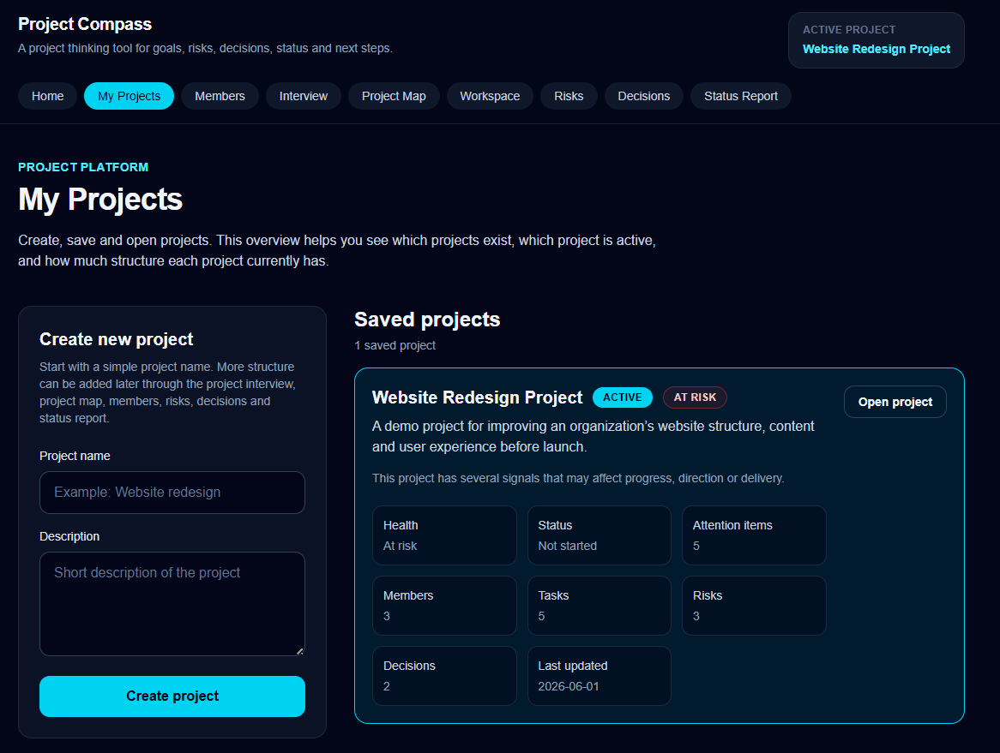
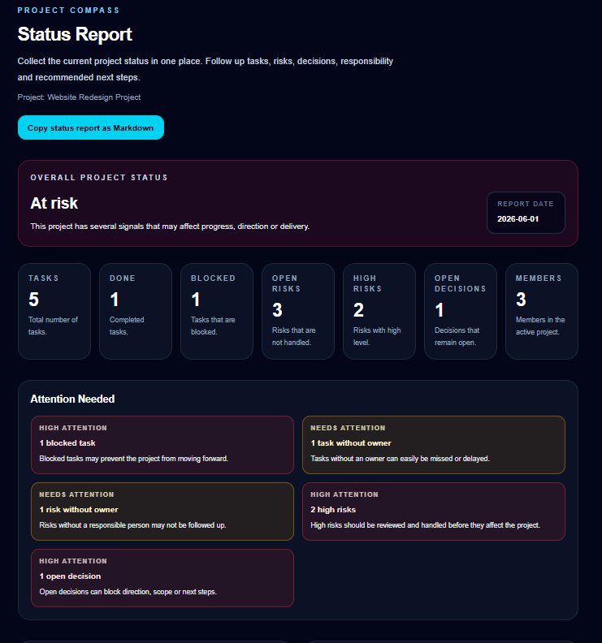

# Project Compass

**Project clarity before task tracking.**

Project Compass is a project clarity and project management MVP for smaller projects where purpose, responsibility, risks, decisions, traceability and current project status need to remain visible.

Instead of starting with task tracking alone, Project Compass is designed to help teams understand the project itself: what matters, who is responsible, what needs attention, how risks and decisions affect the work, and what should happen next.

For me, Project Compass is also a practical Quality Engineering project. I use it to develop product thinking, risk-based testing, regression testing, test automation and CI while evolving a real application in small, reviewable steps.

## Live demo

[Open Project Compass](https://project-compass-seven.vercel.app/)

The current version stores project data locally in the browser using `localStorage`. It is not yet a multi-user application.

---

## Screenshots

### Project overview

The project overview brings together saved projects, active project status, Project Health, Attention Needed and key project metrics.



### Status Report

The Status Report summarizes current project status, including tasks, risks, decisions, ownership, Project Health, traceability and a recommended next step.



---

## Product focus

Project Compass is designed for smaller projects where clarity around purpose, responsibility, risks, decisions and status matters more than advanced enterprise workflow features.

It is not intended to compete feature-for-feature with tools such as Jira, Trello or Asana. The product is guided by a simpler question:

> Does this help the user understand, steer or improve the project?

This keeps the scope focused on project clarity rather than feature volume.

---

## Current capabilities

Project Compass has evolved from a single-project MVP into a small project platform.

The current version supports:

- Multiple saved projects with an active project model
- Project members and responsibility for tasks, risks and decisions
- Task, risk and decision management
- Risk-to-task and decision-to-task traceability
- Project setup guidance and Project Map
- Attention Needed based on project signals
- Rule-based Project Health with explanatory reasons
- A simple Project Health Score
- Recommended Next Step based on blocked work, risks, decisions, ownership and traceability
- Status Report with Markdown export
- Form validation, improved empty states and no-active-project recovery
- Automated end-to-end testing with Playwright
- Continuous integration with GitHub Actions
- Live deployment on Vercel

Project data is currently persisted in browser `localStorage`, so the application remains local to the browser and device where it is used.

---

## Quality Engineering focus

Project Compass is both a working product MVP and a practical Quality Engineering case.

The project is used to develop and demonstrate work with:

- Product and risk thinking before implementation
- Manual exploratory and regression testing
- Playwright end-to-end testing of important user flows
- Negative input, validation and recovery scenarios
- Empty states and no-active-project behaviour
- Responsibility and missing-ownership scenarios
- Risk-to-task and decision-to-task traceability
- Rule-based Project Health and scenario-based verification
- Recommended Next Step behaviour based on project signals
- Status Report and Markdown export verification
- GitHub Actions CI
- Written test strategy and manual regression documentation

Several product and test issues have been found during development, reproduced, corrected and checked through regression testing. Automated tests are added where repeatable verification provides useful protection against regressions.

The aim is not only to show that the application works, but to make the quality work reviewable: what was considered important, what could fail, how behaviour was verified and what limitations remain.

---

## Application flow

A typical Project Compass flow is:

1. Create, open or load an example project.
2. Review project structure, Project Health and Attention Needed.
3. Add members and create tasks, risks and decisions with clear responsibility.
4. Connect risks and decisions to the tasks they affect.
5. Review traceability, project signals and the Recommended Next Step.
6. Use the Status Report to review or export the current project situation.

This flow keeps project context, responsibility, risk and status connected instead of treating them as separate lists.

---

## Tech stack

* Next.js
* React
* TypeScript
* Tailwind CSS
* Playwright
* Git / GitHub
* GitHub Actions
* Vercel
* localStorage

---

## Repository structure

The repository is organized around a few main areas:

* `src/app/` – application pages and product flows
* `src/components/` – shared UI components
* `src/lib/` – shared project data, storage and project insight logic
* `tests/` – Playwright end-to-end and regression tests
* `docs/` – product, QA and testing documentation
* `public/screenshots/` – screenshots used in the project documentation

The repository structure evolves with the application, so the source tree itself is the authoritative reference for individual files.

---

## Documentation

Additional product and QA documentation is available in `docs/`:

* [`product-vision.md`](docs/product-vision.md) – product idea and positioning
* [`mvp-scope.md`](docs/mvp-scope.md) – MVP scope and boundaries
* [`user-stories.md`](docs/user-stories.md) – documented user needs and flows
* [`test-strategy.md`](docs/test-strategy.md) – testing approach and priorities
* [`manual-test-run.md`](docs/manual-test-run.md) – documented manual regression testing
* [`project-platform-roadmap.md`](docs/project-platform-roadmap.md) – evolution from the original MVP toward the project platform
* [`responsibility-model-plan.md`](docs/responsibility-model-plan.md) – responsibility model for tasks, risks and decisions

These documents provide more detail than the main README and preserve parts of the product and QA reasoning behind the implementation.

---

## Testing and verification

Project Compass uses testing at different levels depending on the risk and behaviour being verified.

### Playwright

Playwright is used for end-to-end and regression testing of important product flows, including:

* Project creation and persistence
* Members and responsibility
* Tasks, risks and decisions
* Validation, empty states and recovery paths
* Attention Needed and Project Health
* Risk-to-task and decision-to-task traceability
* Recommended Next Step behaviour
* Status Report and Markdown export
* Legacy task migration behaviour

The Playwright configuration includes Chromium, Firefox and WebKit. Most focused product tests are intended for Chromium, while selected broader behaviour can be checked across the configured browsers.

### Vitest

Vitest is used for focused testing of storage-boundary logic in `src/lib/projectStorage.test.ts`.

Current coverage includes:

* Schema version handling
* Malformed stored JSON
* Legacy and unsupported state
* Normalization of missing collections
* Invalid active-project references
* Protection against overwriting malformed or unsupported stored data
* Writing the current schema version when state is saved

This complements the browser-level tests by testing data-integrity behaviour directly without requiring a full UI flow.

### Manual and exploratory testing

Manual regression and exploratory testing are also used for important product flows and usability behaviour.

Documented examples include finding and investigating:

* Navigation and recovery problems
* Missing validation feedback
* Weak empty states
* Ambiguous Playwright locators
* Tests coupled too tightly to UI text
* Clipboard-related test constraints
* Mixed-language and encoding issues
* Local Windows/OneDrive development issues

More detail is available in [`docs/manual-test-run.md`](docs/manual-test-run.md) and [`docs/test-strategy.md`](docs/test-strategy.md).

### Continuous integration

GitHub Actions currently runs on pushes and pull requests to `master`.

The current workflow:

* Installs dependencies and Playwright browsers
* Runs the landing-page test across the configured browser projects
* Runs the main-flow test in Chromium
* Uploads the Playwright HTML report as an artifact

The current CI workflow does **not** yet run the complete Playwright suite, the Vitest suite or `npm run build`.

### Test commands

Run the Vitest suite:

```bash
npm run test:unit
```

Run all Playwright tests:

```bash
npx playwright test
```

Run the landing-page test:

```bash
npx playwright test tests/landing-page.spec.ts
```

Run the main flow in Chromium:

```bash
npx playwright test tests/main-flow.spec.ts --project=chromium
```

Open the latest Playwright HTML report:

```bash
npx playwright show-report
```

---

## Run locally

Project Compass currently targets Node.js 24.

Install dependencies:

```bash
npm install
```

Start the development server:

```bash
npm run dev
```

Open:

```text
http://localhost:3000
```

Create a production build:

```bash
npm run build
```

The public demo is deployed on Vercel and linked at the top of this README.

---

## Known limitations

Project Compass is still an MVP and is not intended to represent a production-ready multi-user project platform.

Current limitations include:

* Project data is stored locally in the browser rather than in a backend database.
* There are no user accounts, authentication or role-based access control.
* Data is not synchronized between browsers or devices.
* There is no real-time collaboration.
* Storage consolidation is still in progress. The canonical `project-compass-state` model exists alongside remaining legacy compatibility paths and storage keys.
* Editing and deletion are not yet consistently available across all main project objects.
* User-facing filtering and sorting are not yet a developed part of the product.
* Traceability currently focuses on simple risk-to-task and decision-to-task relationships rather than a broader dependency model.
* Project Health and Project Health Score are intentionally simple and rule-based. They are project-support signals, not validated measures of project performance.

These limitations define the current product boundary and help keep development focused on project clarity, data integrity, testability and the needs of a small-scale pilot.

---

## Next steps

The current priority is to make Project Compass reliable and understandable enough for a small classroom pilot before adding broader platform features.

Near-term work focuses on:

* Completing storage consolidation and reducing remaining legacy data paths
* Improving persistence, recovery and data-integrity behaviour
* Strengthening critical automated regression coverage
* Improving editing, deletion and other core project-management flows where needed
* Refining onboarding, validation and accessibility based on actual use
* Collecting pilot feedback before considering larger architectural changes

A backend, authentication and real-time multi-user collaboration are intentionally deferred until real usage demonstrates that they are needed.

---

## Development approach

Project Compass is developed in small, reviewable iterations.

A typical change follows this pattern:

1. Identify the user, product or quality problem.
2. Define the intended behaviour and relevant acceptance criteria.
3. Implement the smallest useful change.
4. Test the behaviour manually and investigate negative or recovery scenarios where relevant.
5. Add or update automated tests when repeatable regression protection is valuable.
6. Run relevant tests and a production build before considering the change complete.
7. Document important decisions, limitations or test evidence when needed.
8. Commit the change with a focused message.

The emphasis is on understanding why a change is needed, verifying that it behaves as intended and keeping the resulting evidence reviewable.

---

## Copyright

© 2026 Johan Larsson. All rights reserved.

See [NOTICE.md](NOTICE.md) for additional information.